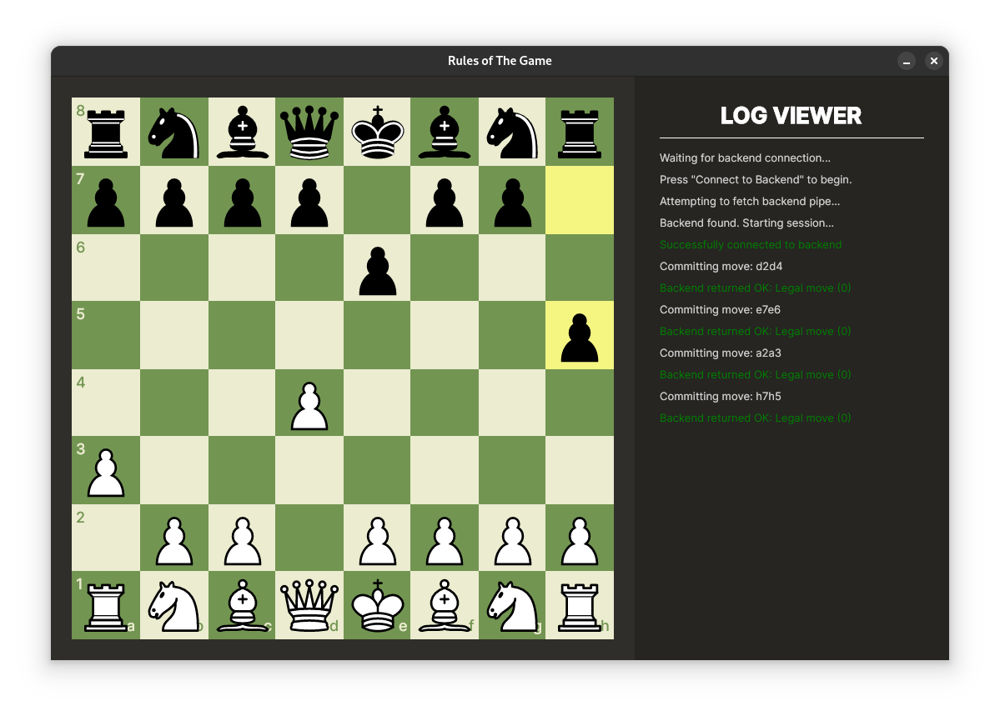

# Chess—Frontend

A [Chess.com](https://chess.com)-like GUI frontend powered by the Avalonia UI framework.

Submitted as part of the Magshimim National Cyber Program year 2, sem. 1 project.

## "Frontend"?

This program is made to communicate with the [Chess Backend]() - a move validator "server".

Their communication is achieved via **named pipes** in Windows and a **FIFO file** in Linux/Unix—depending on the active operating system at runtime.

## In This Project

- The fundamental implementations and rules of a Chess game
  - En Passant
- Cross-platform support for Windows and Unix-based systems
- Properly resizable GUI
